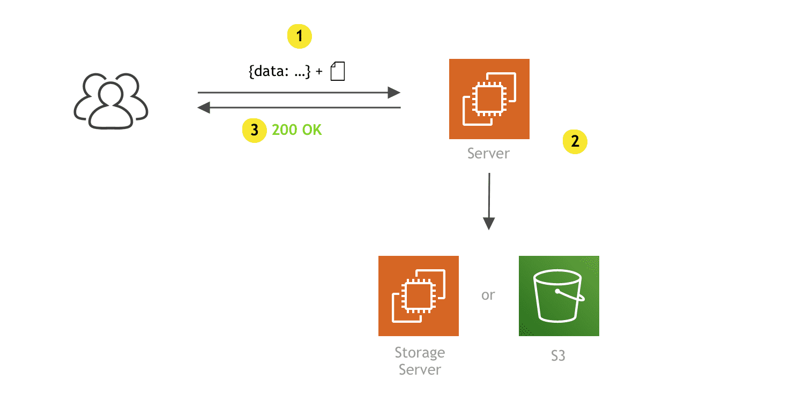
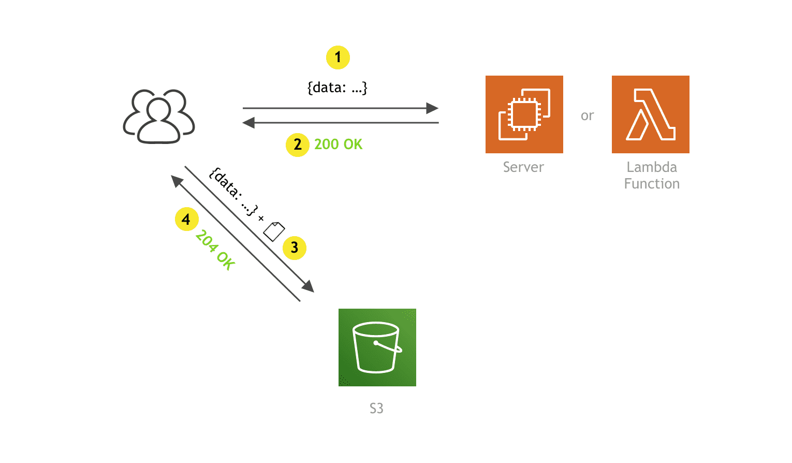

## Description

This project help to manage the access to Minio server, and automatically generate thumbnails.

## Approach

<p align="center">
  
  </br>
  <strong>Proxy Approach<strong/>
  </br>
</p>

Instead of using classical proxy approach, this server use presigned urls to upload and retrieve documents, this method give a direct, fast and secure access to documents without using a server with lot of resource (RAM, CPU and Bandwidth) needed to streaming the data between minio server and the clients.

<p align="center">
  
    </br>
  <strong>PresigedURL Approach<strong/>
  </br>
</p>

So this server focus only on giving permission to user to post or list documents and generating thumbnails for each uploaded image.


## Prerequisites
To run this project will need to have **Docker** & **Docker Compose**. installed in your system.

## How to run the project?
clone the or download the project

The project can be run with a single line, just open the command line, enter to the root folder of the project and run:

```bash
$ docker-compose up
```
&#x1f91e;&#x1f91e;&#x1f91e; ....

## MINIO Server Setup

### Buckets

http://localhost:9001/

username: minio
password: minio123

Create 2 buckets, one for the documents and the other for thumbnails<br>
Getting thumbnail need to be accessible for everyone so we need to change the "Access Policy" and change it to custom with the following setting

```bash
{
    "Version": "2012-10-17",
    "Statement": [
        {
            "Effect": "Allow",
            "Principal": {
                "AWS": [
                    "*"
                ]
            },
            "Action": [
                "s3:GetObject"
            ],
            "Resource": [
                "arn:aws:s3:::thumbnails/*"
            ]
        }
    ]
}
```
### Service Accounts

Create new account and save the AccessKey and the SecretKey for the next step.

## Web App

The entre point for the the server is http://localhost:4000/

Login with the admin account then go to setting and fill the needed information and save.

**Note:** For local testing just keep the **EndPoint**, **Port** and **UseSSL** as provided.

Now you can go to Documents page and upload new documents &#x1f91e;.

## Pages
### Login
Login page contain a simple local authentication **not a backend** just for testing, with two user type; simple user and an admin

### Documents
This page provide a list documents **thumbnails**, and a Box to Upload new document.

### Setting

This is where setting of MINIO server can be set.

# Rest API

## Get Minio Public Setting

`GET /publicSetting`

## Get Minio Setting

`GET /setting`

## set Minio Setting

`Post /setting`

### Example data:

```bash
{
"endPoint": "17.0.0.10",
"port": 9000,
"useSSL": true,
"accessKey": "qwertyu",
"secretKey": "wertyu",
"bucket": "documents",
"thumbnailBucket": "thumbnails"
}
```

## Get presigned Url to upload document

`GET /presignedPostObject/-objectName-`

## Get presigned Url of document list

`GET /presignedGetObjects`

## Get presigned Url to access a document

`GET /presignedGetObject/-objectName-`


